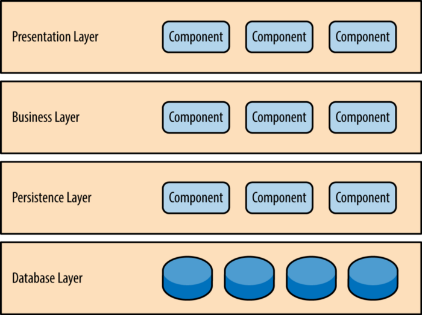
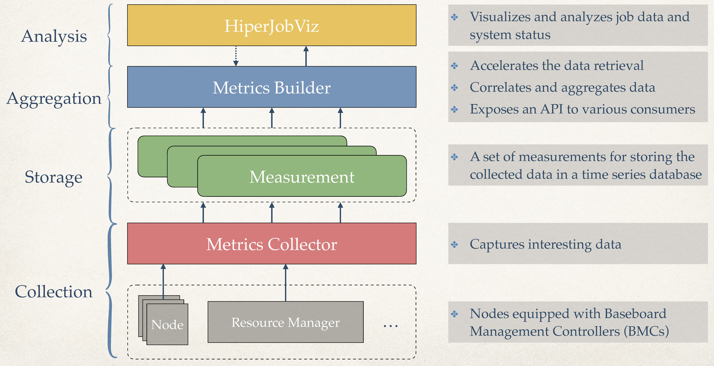
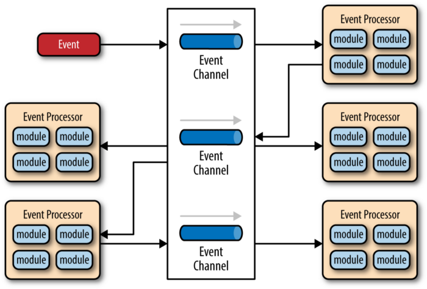
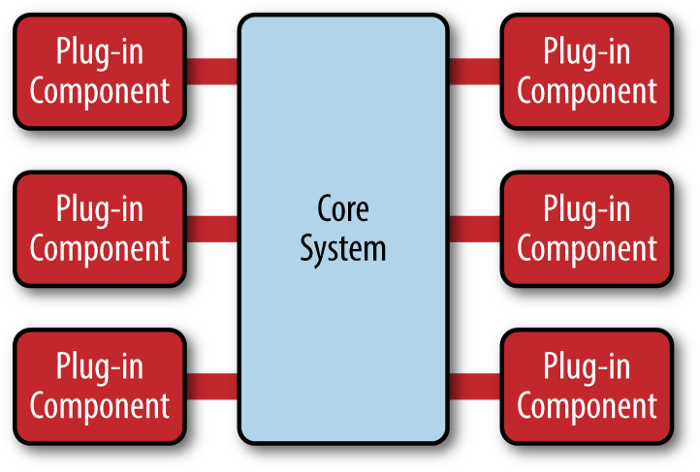
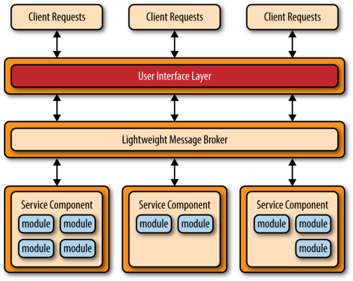
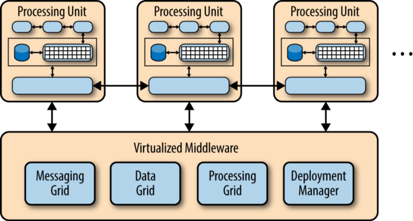

Even I am a researcher working on HPC related topics and software engineering is not my focus, I still find that having some basic knowledge of software architecture patterns helps to design and implement research ideas, and it helps you to plot diagrams of architecture design in your paper. Here, I found a brief introduction of the existing architecture patterns and I would like to share it in the post for future reference.

The original post is [here](https://orkhanscience.medium.com/software-architecture-patterns-5-mins-read-e9e3c8eb47d2), which is summaried based on the book (Software Architecture Patterns)[https://www.goodreads.com/en/book/show/25091671-software-architecture-patterns] by [Mark Richards](https://www.developertoarchitect.com/mark-richards.html).

### 1. Layered architecture ###
It is the most common architecture for monolitic applications. The application is divided into **several layers** each encapsulating specific role. 

Here is another example of layered architecture, which shows the architecture of the [MonSter](https://github.com/nsfcac/MonSter) project:

### 2. Event-driven architecture ###
This pattern decouples the application logic into single-purpose event processing components that **asynchronously** receive and process events. It is known for high **scalability** and **adaptability**. 

### Microkernel Architecture ###
This pattern is also known as Plugin architecture. It has two main components: a **core** system and **plug-in** modules (extensions).

### Microservices Architecture ###
This architecture consists of separately deployed services, where each service has single responsibility ideally. These services are independent of each other and if one service fails others will not stop running. 

### Space-Based Architecture ###
The basic approach is to separate the application into **processing units** (that can automatically scale up and down based on demand), where the data will be replicated and processed between those units without any persistence to the central database (though there will be local storages for the occasion of system failures).

