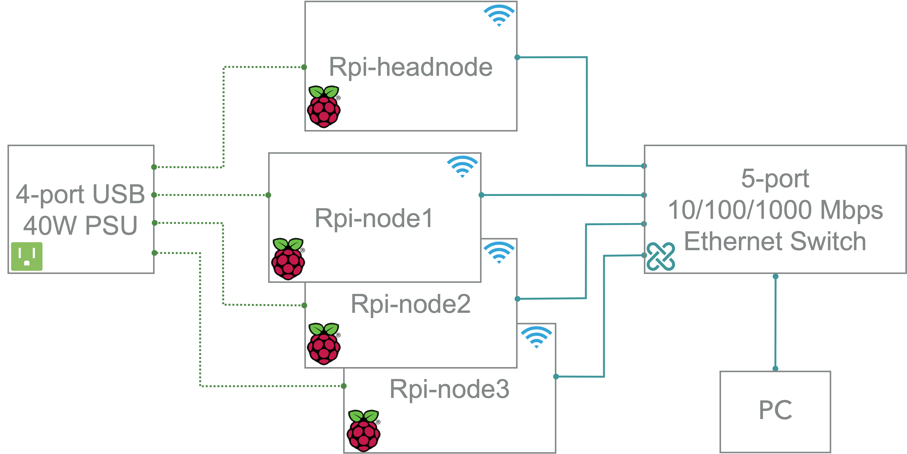
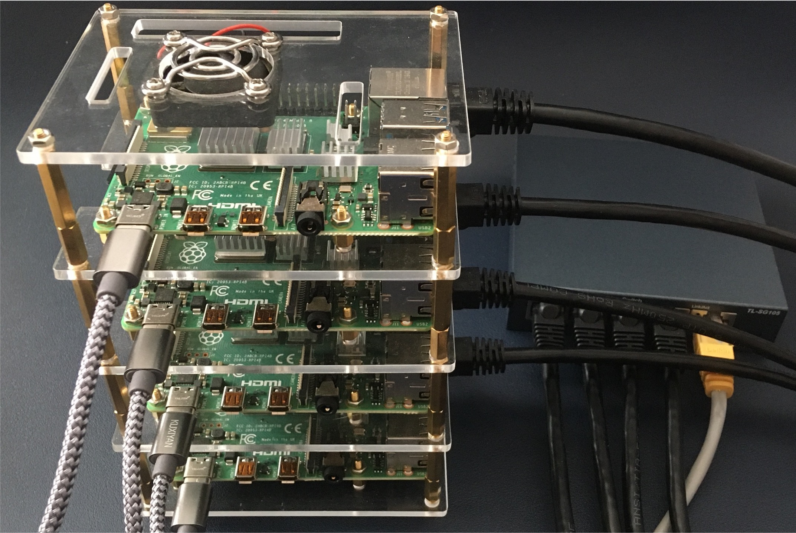
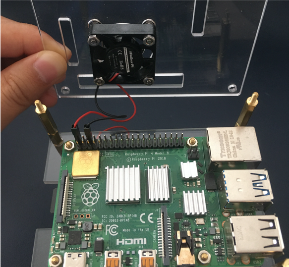

## Background
Building a cluster with Raspberry Pi is a good way to learn about cluster computing and distributed systems. It is also a good way to learn about Linux and networking. In this post, I will show you how to build a cluster with Raspberry Pi.
 
The hardware we need is listed below:
- Four [Raspberry Pi 4 B boards](https://smile.amazon.com/gp/product/B07TC2BK1X/ref=ppx_yo_dt_b_asin_title_o03_s01?ie=UTF8&psc=1)
- Four 64GB MicroSD cards, one for each board
- Cables: four Ethernet cables, four MicroUSB cables, one Micro HDMI cable
- One [40W 8A 4-port USB Charging Station](https://www.ravpower.com/products/rp-uc07-40w-8a-4-port-desktop-charger)
- One 5-port switch
- One [cluster rack](https://www.amazon.com/Connectors-Stackable-Raspberry-Enclosure-Heatsinks/dp/B07MQXRGZR/ref=sr_1_10?crid=239FMUN4XL2AJ&keywords=Raspberry+Pi+4+Cluster+Case&qid=1685068998&s=electronics&sprefix=raspberry+pi+4+cluster+case%2Celectronics%2C85&sr=1-10) that has coolers installed

## Cluster assemble
Easy and self-explanatory. Lots of related videos on Youtube. 

We're going to access each node using wireless LAN and use Ethernet port for communication among nodes. Thus the switch does not have to be connected to internet.

The connection is shown below:



## OS installation
We use CentOS in our cluster. To be noticed, the distribution for armv7hl platform is called "CentOS Userland Linux" and not "CentOS Linux". 

1. For Raspberry Pi 4, we have a limited choice on what version of CentOS we can use. We choose [CentOS-Userland-7-armv7hl-RaspberryPI-Minimal-4](http://mirror.math.princeton.edu/pub/centos-altarch/7/isos/armhfp/CentOS-Userland-7-armv7hl-RaspberryPI-Minimal-4-2009-sda.raw.xz) for our cluster.
2. Download the zip file and unzip it to iso image. Image all microSD cards with CentOS7 using [Raspberry Pi Imager](https://www.raspberrypi.org/blog/raspberry-pi-imager-imaging-utility/). The default root passward is **centos**.

## Expand capacity
There is a ``/root/README`` file that describes how to expand the root partition to capacity of the MicroSD. On each node, follow the instructions to expand the root filesystem using: ``rootfs-expand``

```
== CentOS 7 userland ==

If you want to automatically resize your / partition, just type the following (as root user):
rootfs-expand
```

## Network configuration
#### Wifi
On each node, configure Wifi network with **Network Manager Text User Interface**(`nmtui`) tool. 
#### Ethernet
There is no `eth0` ifcfg files by default. We create a file named  `/etc/sysconfig/network-scripts/ifcfg-eth0` as follows:

```
DEVICE=eth0
BOOTPROTO=none
ONBOOT=yes
PREFIX=24
# IPADDR are 10.0.0.1, 10.0.0.2, 10.0.0.3, 10.0.0.4 for master, node1, node2, node3, respectively. 
IPADDR=10.0.0.1
```

Restart network service: `systemctl restart network`

## [Brand new key](https://magpi.raspberrypi.org/articles/build-a-raspberry-pi-cluster-computer)
For the cluster to work, each worker node needs to be able to talk to the master node without needing a password to login. To do this, we use SSH keys. Run the following:
```
ssh-keygen -t rsa
```
This creates a unique digital "identity" (and key pairs) for the computer. You'll be asked a few questions; just press RETURN for each one and do not create a passphrase when asked. Next, tell the master(10.0.0.1 in our setup) about the keys by running the following on every other node:
```
ssh-copy-id 10.0.0.1
```
Finally, do the same on the master node and copy its key to every other node in the cluster.

## [Setup NFS server](https://www.itzgeek.com/how-tos/linux/centos-how-tos/how-to-setup-nfs-server-on-centos-7-rhel-7-fedora-22.html)
NFS stands for Network File System, helps you to share files and folders between Linux/Unix systems, developed by SUN Microsystems in 1990. NFS enables you to mount a remote share locally.
#### Install NFS server
Install the below package for NFS server using the `yum` command.
```
yum install -y nfs-utils
```
Once the packages are installed, enable and start NFS services.
```
systemctl start nfs-server rpcbind
systemctl enable nfs-server rpcbind
```
#### Create NFS share
Create a directory to share with the NFS client. We will create a new directory named `nfs` in the `/` partition.
```
mkdir /nfs
```
Allow NFS client to read and write to the created directory.
```
chmod 777 /nfs/
```
We have to modify `/etc/exports` file to make an entry of directory `/nfs` that you want to share.
```
vi /etc/exports
```
Create a NFS share:
```
/nfs 10.0.0.2/4(rw,sync,no_root_squash,no_subtree_check)
```
`10.0.0.2/4` defines the range of client IP addresses.

Export the shared directories using the following command.
```
exportfs -r
```
#### Configure firewall
We need to configure the firewall on the NFS server to allow NFS client to access the NFS share. Run the following commands on the NFS server(master, 10.0.0.1)
```
firewall-cmd --permanent --add-service mountd
firewall-cmd --permanent --add-service rpc-bind
firewall-cmd --permanent --add-service nfs
firewall-cmd --reload
```
#### Install NFS client
We need to install NFS packages on NFS client(10.0.0.2, 10.0.0.3, 10.0.0.4) to mount a remote NFS share. Install NFS packages using below command.
```
yum install -y nfs-utils
```
Check the NFS shares available on the NFS server by running the following command on the NFS client.
```
showmount -e 10.0.0.1
```
#### Mount NFS share
Create a directory on NFS client to mount the NFS share `/nfs` which we have created in the NFS server.
```
mkdir /nfs
```
Use blow command to mount a NFS share `/nfs` from NFS server `10.0.0.1` in `/nfs` on NFS client.
```
mount 10.0.0.1:/nfs /nfs
```
You can use the `df -hT` command to check the mounted NFS share.

Create a file on the mounted directory to verify the read and write access on NFS share.
```
touch /nfs/test
```
If other nodes can see the test file, you have working NFS setup.
#### Automount NFS shares.
To mount the shares automatically on every reboot, you would need to modify `/etc/fstab` file of your NFS clients.
```
vi /etc/fstab
```
Add an entry at the end of the file:
```
10.0.0.1:/nfs /nfs nfs auto,noatime,nolock,bg,nfsvers=3,intr,tcp,actimeo=1800 0 0
```
Save and close the file.

Reboot the client machine and check whether the share is automatically mounted or not.

If you want to unmount that shared directory from your NFS client, you can unmount that particular directory using `umount ` command.
```
umount /nfs
```

## The Raspberry Pi Cluster



