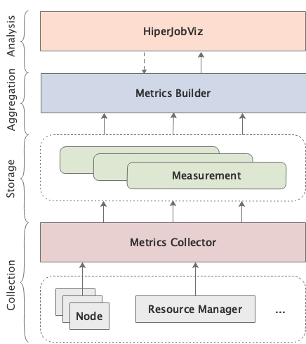

## 📎 Project Summary

High-performance computing (HPC) systems are critical for advancing scientific research but often face operational challenges due to the complexity of monitoring resource utilization and detecting system anomalies. To address this, we developed MonSTer, a powerful yet user-friendly monitoring tool specifically designed for large-scale HPC systems.

MonSTer provides comprehensive real-time monitoring with minimal setup effort, significantly simplifying the monitoring process. Leveraging Redfish API for Baseboard Management Controller (BMC) sensor data retrieval and integrating seamlessly with resource management tools like Univa Grid Engine (UGE) and Slurm, MonSTer collects critical metrics without introducing additional overhead to computing nodes or applications.

<figcaption class="text-center text-sm text-gray-600 dark:text-gray-400 mt-2">Overview of the MonSTer architecture</figcaption>

## 🔑 Key Achievements

- Successfully deployed on the 467-node Quanah cluster at Texas Tech University's HPCC.
- Provides real-time insights into node-level health, including temperature, power usage, and memory status.
- Delivers comprehensive job scheduling visualization to identify user-level resource usage patterns and potential bottlenecks.
- Minimizes network and computational overhead, making it suitable for deployment in production environments.

## 💡 Technical Highlights
- Metrics Collector: Asynchronously queries BMC sensors and resource managers, optimizing collection intervals and data throughput.
- Metrics Builder: Efficiently aggregates data from a time-series database (InfluxDB), significantly reducing query processing times through schema optimization and data compression.
- HiperJobViz: Interactive data analysis and visualization tool that provides clear graphical representations of system status, job scheduling timelines, and resource utilization.

## 🏗 Impact and Applications
MonSTer significantly enhances operational efficiency and reliability of HPC centers by providing administrators with actionable insights into hardware and application performance. This facilitates proactive system maintenance and optimizes resource allocation, benefiting a wide range of scientific and computational research activities.

## 🧭 Future Directions

- Expand monitoring capabilities to include file system and network metrics.
- Increase metric collection resolution through advanced telemetry methods.
- Develop additional analytics and visualization modules tailored for specific research scenarios.

This project was presented at CLUSTER'20 (virtual) in Kobe, Japan. 