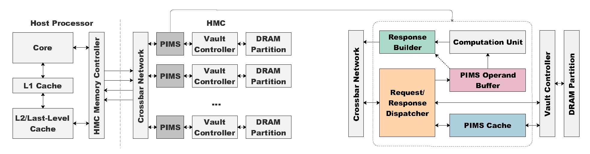

## 📎 Project Summary

Stencil computations play a pivotal role in various high-performance scientific applications, including image processing, fluid dynamics, and solving partial differential equations. However, their performance is often severely constrained by extensive data movements and limited memory bandwidth, commonly referred to as the "Memory Wall." To overcome these limitations, we introduced PIMS, a novel lightweight processing-in-memory (PIM) accelerator specifically designed to enhance the efficiency of stencil computations.

PIMS capitalizes on the logic layer of advanced 3D-stacked memory technologies, notably the Hybrid Memory Cube (HMC), to substantially reduce redundant memory traffic by conducting arithmetic operations directly within the memory. Our innovative approach includes a custom PIMload&add instruction that efficiently manages data-intensive operations, achieving significant performance enhancements with minimal alterations to existing hardware architectures.

<figcaption class="text-center text-sm text-gray-600 dark:text-gray-400 mt-2">Overview of the PIMS architecture and PIMS detail</figcaption>

## 🔑 Key Achievements

- Achieved an average reduction of 48.25% in memory traffic and up to 65.55% fewer bank conflicts.
- Successfully integrated the accelerator into Hybrid Memory Cube (HMC) technology.
- Demonstrated significant bandwidth utilization improvements, particularly for high-order stencil computations.

## 💡 Technical Highlights
- Seamless integration into existing HMC infrastructure, ensuring practicality, cost-effectiveness, and minimal design overhead.
- Specialized in-memory caching mechanism (PIMS cache) developed to significantly reduce DRAM accesses, latency, and power consumption.
- Optimized operand buffer and request-response dispatcher enhance computational efficiency by maximizing memory-level parallelism and computational throughput.

## 🏗 Impact and Applications
PIMS represents a significant step toward overcoming memory bottlenecks in computationally intensive scientific applications. It paves the way for more efficient and high-performance computing solutions in a variety of domains, such as climate modeling, computational physics, and large-scale simulations.

## 🧭 Future Directions

- Further optimization of bandwidth efficiency and in-depth exploration of PIMS's impact on latency and power efficiency.
- Extension and adaptation of processing-in-memory strategies to broader classes of memory-intensive applications beyond stencil computations.

This project was presented at MemSys '19 in Washington, DC, USA.